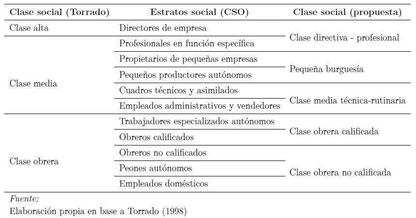

class: inverse right middle 

```{r carga de bases y librerias, include = FALSE, message=FALSE, warning=FALSE, error=FALSE}

#carga de bases y librerías
rm(list = ls())
knitr::opts_chunk$set(echo = FALSE, warning = FALSE, message = FALSE, error = FALSE, dpi = 300)
load("engho0418_hog.RData")

pacman::p_load(tidyverse, ggsci, jtools, huxtable, gtsummary, survey, kableExtra, icons)
theme_set(theme_bw())
knitr::opts_chunk$set(fig.pos = "H", out.extra = "")

#Gastos per cápita
engho0418_hog$gastotpc <- engho0418_hog$gastot / engho0418_hog$cantmiem

engho0418_hog$gc09_01_pc <- engho0418_hog$gc09_01 / engho0418_hog$cantmiem
engho0418_hog$gc09_02_pc <- engho0418_hog$gc09_02 / engho0418_hog$cantmiem
engho0418_hog$gc09_03_pc <- engho0418_hog$gc09_03 / engho0418_hog$cantmiem
engho0418_hog$gc09_04_pc <- engho0418_hog$gc09_04 / engho0418_hog$cantmiem
engho0418_hog$gc09_05_pc <- engho0418_hog$gc09_05 / engho0418_hog$cantmiem
engho0418_hog$gc09_06_pc <- engho0418_hog$gc09_06 / engho0418_hog$cantmiem
engho0418_hog$gc09_07_pc <- engho0418_hog$gc09_07 / engho0418_hog$cantmiem
engho0418_hog$gc09_08_pc <- engho0418_hog$gc09_08 / engho0418_hog$cantmiem
engho0418_hog$gc09_09_pc <- engho0418_hog$gc09_09 / engho0418_hog$cantmiem

#Variables construidas
engho0418_hog$anio2 <- factor(engho0418_hog$anio2, labels = c("2004-2005", "2012-2013", "2017-2018"))

engho0418_hog$alimentos <- engho0418_hog$gc09_01
engho0418_hog$vivienda <- engho0418_hog$gc09_03
engho0418_hog <- engho0418_hog %>% 
	mutate(resto_consumo = sum(gc09_02, gc09_04, gc09_05, gc09_06, gc09_07, gc09_08, gc09_09, na.rm = TRUE))

engho0418_hog$alimentos_ln <- log(engho0418_hog$alimentos)
engho0418_hog$vivienda_ln <- log(engho0418_hog$vivienda)
engho0418_hog$resto_ln <- log(engho0418_hog$resto_consumo)
engho0418_hog$gastot_ln <- ifelse(engho0418_hog$gastot <= 0, engho0418_hog$gastot_ln == .5, engho0418_hog$gastot)
engho0418_hog$gastot_ln <- log(engho0418_hog$gastot_ln)
```

# 1. Propuesta de la ponencia

---
# Objetivos y alcance  

.left-column[
## Punto de partida
]

.right-column[
- Estudios estratificación y movilidad social en los últimos años  
  
- ¿Bienestar = ingresos monetarios?]

---
# Objetivos y alcance  

.left-column[
## Punto de partida
## Objetivo general
]

.right-column[
- Estudios estratificación y movilidad social en los últimos años  

- ¿Bienestar = ingresos monetarios?  
<br>

**Explorar** la dimensión del consumo y su distribución en la estructura clases en las dos primeras décadas del siglo XXI en Argentina.]

---
# Objetivos y alcance  

.left-column[
## Punto de partida
## Objetivo general
## Objetivos específicos]

.right-column[
- Estudios estratificación y movilidad social en los últimos años  

- ¿Bienestar = ingresos monetarios?  
<br>

**Explorar** la dimensión del consumo y su distribución en la estructura clases en las dos primeras décadas del siglo XXI en Argentina.  
<br>

- Tendencia de la desigualdad de ingresos y el gasto de consumo de los hogares 

- Distribución de ingresos y el gasto de consumo por clase social

- Peso del posicionamiento de clase sobre el gasto de consumo de los hogares (con controles)]

---
# Consumo y análisis de clase  

+ Estructura de clases  `r icons::fontawesome("long-arrow-alt-right", style = "solid")`  Oportunidades  

--

+ Escasez de estudios sobre clases sociales que incorporen la dimensión del consumo  
	+ Consumo cultural
	+ Stocks de bienes durables 
	
--

+ Mirada desde la economía  
	+ Consumo como ingreso permanente
	+ Vínculos entre la desigualdad de ingresos y consumo  
	
--

+ Estudios recientes a partir de la ENES-PISAC `r icons::fontawesome("long-arrow-alt-right", style = "solid")` consumo, bancarización, acceso al crédito  

---
# Contexto histórico 

.left-column[
## 2003-2008
] 

.right-column[
- Énfasis en las políticas de producción, empleo y en la creciente intervención estatal  
- Fuerte reducción de la desocupación y de la pobreza
]  

---
# Contexto histórico

.left-column[
## 2003-2008
<br>
## 2008-2015
] 

.right-column[
- Énfasis en las políticas de producción, empleo y en la creciente intervención estatal  
- Fuerte reducción de la desocupación y de la pobreza  
<br>
- Menor dinamismo en la creación de empleo y crecimiento de la inflación  
- Políticas anticíclicas: reestatización fondos privados de jubilación e implementación AUH  
- Políticas de fomento al consumo, bancarización y crédito: Ahora12, Argenta, acuerdos específicos.
]  

---
# Contexto histórico

.left-column[
## 2003-2008
<br>
## 2008-2015
<br>
<br>
## 2015-2019
] 

.right-column[
- Énfasis en las políticas de producción, empleo y en la creciente intervención estatal  
- Fuerte reducción de la desocupación y de la pobreza  
<br>
- Menor dinamismo en la creación de empleo y crecimiento de la inflación  
- Políticas anticíclicas: reestatización fondos privados de jubilación e implementación AUH  
- Políticas de fomento al consumo, bancarización y crédito: Ahora12, Argenta, acuerdos específicos  
<br>
- Políticas regresivas: aumento en las tarifas, devaluación monetaria, liberalización del mercado financiero, alza de las tasas de interés y apertura de importaciones  
- Disminución del salario real y aumento del desempleo 
]  

---
class: inverse right middle 

# 2. Diseño Metodológico

---
# Fuente de datos  

- Encuesta Nacional de Gastos de los Hogares (**ENGHo**) realizada por el INDEC  

- Ondas de 2004-2005, 2012-2013, 2017-2018  

- Encuesta más compleja y completa del Sistema Estadístico Nacional 

	- Compuesta por 5 cuestionarios

- Objetivo principal: conocer la estructura de gastos de los hogares para luego poder calcular las canastas de bienes y servicios.  

- Problemas en la armonización de variables  
	- 2012-2013 `r icons::fontawesome("long-arrow-alt-right", style = "solid")` ¿ocupación?  

- Universo de estudio: hogares que cuentan con, al menos, uno de los cónyuges ocupado (o jefe/a de hogar en el caso de hogares no nucleares). Total país urbano.  

---
  

---
# Esquema de clases  

- Basado en la propuesta de Torrado (1992, 1998)  

- La posición de clase del hogar se deriva de la situación de clase del jefe/a o cónyuge cuya inserción este mejor situada  

```{r, fig.align='center', echo=FALSE, out.width= '100%'}

```
---
# Estructura de clases comparada

```{r estructura de clases, fig.align='center', out.width= '70%'}

engho0418_hog %>% 
	filter(!is.na(clase_mod_factor)) %>% 
	group_by(clase_mod_factor, anio2) %>% 
	tally(wt=pondera) %>% 
	group_by(anio2) %>% 
  mutate(percent = n/sum(n)) %>% 
  ggplot(aes(x=clase_mod_factor, fill = anio2, y = percent)) +
	geom_bar(position="dodge", stat="identity") +
	geom_text(aes(label = scales::percent(percent, accuracy = 0.1)),
            position = position_dodge(1), size = 4, vjust = -0.5) +
  scale_fill_ucscgb(labels = c("2004-2005", "2017-2018"))  +
  labs(caption = "Fuente: Elaboración propia en base a ENGHo-INDEC 2004-2018",
  		 fill = "Año") +
  theme(legend.title = element_text(size = 12, face = "bold"),
        legend.text = element_text(size = 12),
        legend.key.height=unit(1, "cm"),
        axis.title.x = element_blank(),
        axis.title.y = element_blank(),
        axis.text.y = element_text(size = 12),
        axis.text.x = element_text(vjust = 0.5, size = 12),
        plot.caption = element_text(size = 10, hjust = 1),
        panel.grid = element_line(size = .2),
        strip.text = element_text(face = "bold"),
        legend.background = element_blank()) +
	scale_y_continuous(labels= scales::percent_format(accuracy = 1L), breaks=seq(0, 1, 0.05)) +
	scale_x_discrete(labels = function(x) str_wrap(x, width = 13))
```

---
class: inverse right middle 

# 3. Tendencias generales

---
.left-column[
# Evolución de los ingresos y gastos de los hogares
]

.right-column[

```{r evolucion ingresos y gastos 1, out.width= '100%'}

engho0418_hog %>% 
	group_by(anio2) %>% 
	summarise(gasto = weighted.mean(gastot_def, w = pondera),
						ingreso = weighted.mean(ingtoth_def, w = pondera)) %>%
	pivot_longer(!anio2, names_to = "tipo", values_to = "mean") %>% 
  ggplot(aes(x=anio2, fill = tipo, y = mean)) +
	geom_bar(position="dodge", stat="identity") +
  scale_fill_ucscgb(labels = c("Gastos", "Ingresos"))  +
  labs(caption = "Fuente: Elaboración propia en base a ENGHo-INDEC 2004-2018.\nValores deflactados a 2004",
       y = "Promedio ingresos-gastos del hogar",
  		 fill = "Tipo") +
  theme(legend.title = element_text(size = 12, face = "bold"),
        legend.text = element_text(size = 12),
        legend.key.height=unit(1, "cm"),
        axis.title.x = element_blank(),
        axis.title.y = element_text(size = 12),
        axis.text.y = element_text(size = 12),
        axis.text.x = element_text(vjust = 0.5, size = 12),
        plot.caption = element_text(size = 10, hjust = 1),
        panel.grid = element_line(size = .2),
        strip.text = element_text(face = "bold"),
        legend.background = element_blank()) +
  scale_y_continuous(breaks = seq(0, 2000, by = 100))+
	scale_x_discrete(labels = c("2004-2005", "2012-2013", "2017-2018"))
```

]

---
.left-column[
# Estructura del gasto de los hogares
]

.right-column[

```{r estructura del gasto, out.width= '100%'}

engho0418_hog %>% 
	group_by(anio2) %>% 
	summarise(gc01 = weighted.mean(gc09_01, w = pondera, na.rm = TRUE),
						gc02 = weighted.mean(gc09_02, w = pondera, na.rm = TRUE),
						gc03 = weighted.mean(gc09_03, w = pondera, na.rm = TRUE),
						gc04 = weighted.mean(gc09_04, w = pondera, na.rm = TRUE),
						gc05 = weighted.mean(gc09_05, w = pondera, na.rm = TRUE),
						gc06 = weighted.mean(gc09_06, w = pondera, na.rm = TRUE),
						gc07 = weighted.mean(gc09_07, w = pondera, na.rm = TRUE),
						gc08 = weighted.mean(gc09_08, w = pondera, na.rm = TRUE),
						gc09 = weighted.mean(gc09_09, w = pondera, na.rm = TRUE)) %>%
	pivot_longer(!anio2, names_to = "tipo", values_to = "mean") %>% 
	mutate(tipo = factor(tipo, labels = c("Alimentos y bebidas", "Indumentaria y calzado",
																				"Vivienda, agua, electricidad, gas y otros combustibles",
																				"Equipamiento y mantenimiento del hogar",
																				"Salud", "Transporte y comunicaciones", 
																				"Recreación y cultura","Educación",
																				"Bienes y servicios varios"))) %>% 
	group_by(anio2) %>% 
	mutate(gastot = sum(mean),
				 porcentaje = (mean / gastot)) %>% 
	ggplot(aes(x=anio2, fill = tipo, y = porcentaje)) +
  geom_bar(position="stack", stat="identity") +
	geom_text(aes(label = scales::percent(porcentaje, accuracy = 0.1)),
            position = position_stack(.5), size = 4) +
  scale_fill_ucscgb(labels = function(x) str_wrap(x, width = 20)) +
  labs(caption = "Fuente: Elaboración propia en base a ENGHo-INDEC 2004-2018.",
       y = "% gastos del hogar",
  		 fill = "Rubro de gasto") +
  theme(legend.title = element_text(size = 12, face = "bold"),
        legend.text = element_text(size = 12),
        legend.key.height=unit(1, "cm"),
        axis.title.x = element_blank(),
        axis.title.y = element_text(size = 12),
        axis.text.y = element_text(size = 12),
        axis.text.x = element_text(vjust = 0.5, size = 2),
        plot.caption = element_text(size = 10, hjust = 1),
        panel.grid = element_line(size = .2),
        strip.text = element_text(face = "bold"),
        legend.background = element_blank()) +
  scale_y_continuous(labels= scales::percent_format(accuracy = 1L), breaks=seq(0, 1, 0.1))+
	scale_x_discrete(labels = c("2004-2005", "2012-2013", "2017-2018"))
	
```

]

---
.left-column[
## ¿Cómo evolucionó la desigualdad de ingresos y gastos?
]

.right-column[

```{r desigualdad ingresos gastos, out.width= '100%'}

desigualdad <- engho0418_hog %>% 
	select(anio2, gastot, ingtoth, pondera) %>% 
	mutate(gastot = ifelse(gastot <= 0, 0.000001, gastot),
				 ingtoth = ifelse(ingtoth <= 0, 0.000001, ingtoth))

desigualdad %>% 
  group_by(anio2) %>% 
  summarise(theiling = dineq::theil.wtd(ingtoth, weights = pondera),
  			 theilgasto = dineq::theil.wtd(gastot, weights = pondera),
  			 giniing = dineq::gini.wtd(ingtoth, weights = pondera),
  			 ginigasto = dineq::gini.wtd(gastot, weights = pondera)) %>% 
	pivot_longer(!anio2, names_to = "tipo", values_to = "mean") %>% 
  ggplot(aes(x=anio2, fill = tipo, y = mean)) +
	geom_bar(position="dodge", stat="identity") +
  scale_fill_ucscgb(labels = c("Gini - gastos",
  														 "Gini - ingresos", "Theil - gastos", "Theil - ingresos"))  +
  labs(caption = "Fuente: Elaboración propia en base a ENGHo-INDEC 2004-2018.",
  		 fill = "Coeficientes") +
  theme(legend.title = element_text(size = 12, face = "bold"),
        legend.text = element_text(size = 12),
        legend.key.height=unit(1, "cm"),
        axis.title.x = element_blank(),
        axis.title.y = element_blank(),
        axis.text.y = element_text(size = 12),
        axis.text.x = element_text(vjust = 0.5, size = 12),
        plot.caption = element_text(size = 10, hjust = 1),
        panel.grid = element_line(size = .2),
        strip.text = element_text(face = "bold"),
        legend.background = element_blank()) +
  scale_y_continuous(breaks = seq(0, .5, by = .05))+
	scale_x_discrete(labels = c("2004-2005", "2012-2013", "2017-2018"))

	
```

]

---
.left-column[
## ¿Cómo evolucionó la desigualdad en los gastos por rubros?
]

.right-column[

```{r desigualdad ingresos gastos 2, out.width= '100%'}

desigualdad <- engho0418_hog %>% 
	select(anio2, gc09_01:gc09_09, pondera) %>% 
	mutate(gc09_01 = ifelse(gc09_01 <= 0, 0.000001, gc09_01),
				 gc09_02 = ifelse(gc09_02 <= 0, 0.000001, gc09_02),
				 gc09_03 = ifelse(gc09_03 <= 0, 0.000001, gc09_03),
				 gc09_04 = ifelse(gc09_04 <= 0, 0.000001, gc09_04),
				 gc09_05 = ifelse(gc09_05 <= 0, 0.000001, gc09_05),
				 gc09_06 = ifelse(gc09_06 <= 0, 0.000001, gc09_06),
				 gc09_07 = ifelse(gc09_07 <= 0, 0.000001, gc09_07),
				 gc09_08 = ifelse(gc09_08 <= 0, 0.000001, gc09_08),
				 gc09_09 = ifelse(gc09_09 <= 0, 0.000001, gc09_09))

desigualdad %>% 
  group_by(anio2) %>% 
  summarise(gc01_t = dineq::theil.wtd(gc09_01, weights = pondera),
  					gc02_t = dineq::theil.wtd(gc09_02, weights = pondera),
  					gc03_t = dineq::theil.wtd(gc09_03, weights = pondera),
  					gc04_t = dineq::theil.wtd(gc09_04, weights = pondera),
  					gc05_t = dineq::theil.wtd(gc09_05, weights = pondera),
  					gc06_t = dineq::theil.wtd(gc09_06, weights = pondera),
  					gc07_t = dineq::theil.wtd(gc09_07, weights = pondera),
  					gc08_t = dineq::theil.wtd(gc09_08, weights = pondera),
  					gc09_t = dineq::theil.wtd(gc09_09, weights = pondera)) %>% 
	pivot_longer(!anio2, names_to = "tipo", values_to = "mean") %>% 
	mutate(tipo = factor(tipo, labels = c("Alimentos y bebidas", "Indumentaria y calzado",
																				"Vivienda, agua, electricidad, gas y otros combustibles",
																				"Equipamiento y mantenimiento del hogar",
																				"Salud", "Transporte y comunicaciones", 
																				"Recreación y cultura","Educación",
																				"Bienes y servicios varios"))) %>% 
  ggplot(aes(x=anio2, fill = tipo, y = mean)) +
	geom_bar(position="dodge", stat="identity") +
  scale_fill_ucscgb(labels = function(x) str_wrap(x, width = 20))  +
  labs(title = "Evolución coeficiente de Theil de los gastos de los hogares por rubro",
  		caption = "Fuente: Elaboración propia en base a ENGHo-INDEC 2004-2018.",
  		 fill = "Rubros") +
  theme(legend.title = element_text(size = 12, face = "bold"),
        legend.text = element_text(size = 12),
        legend.key.height=unit(1, "cm"),
  			plot.title = element_text(size = 14, face = "bold"),
        axis.title.x = element_blank(),
        axis.title.y = element_blank(),
        axis.text.y = element_text(size = 12),
        axis.text.x = element_text(vjust = 0.5, size = 12),
        plot.caption = element_text(size = 10, hjust = 1),
        panel.grid = element_line(size = .2),
        strip.text = element_text(face = "bold"),
        legend.background = element_blank()) +
  scale_y_continuous(breaks = seq(0, 2, by = .1))+
	scale_x_discrete(labels = c("2004-2005", "2012-2013", "2017-2018"))

	
```

]

---
class: inverse right middle 

# 4. Análisis por clase social

---
# Brechas de ingresos y gastos por clase social  

.pull-left[
```{r brechas por clase ingresos, out.width= '100%'}

t_shift <- scales::trans_new("shift",
                             transform = function(x) {x-1},
                             inverse = function(x) {x+1})

engho0418_hog %>% 
	filter(anio2 != 2013, !is.na(clase_mod_factor)) %>% 
	group_by(anio2, clase_mod_factor) %>% 
	mutate(mean = weighted.mean(ipcf, w = pondera, na.rm = T)) %>% 
	group_by(anio2) %>% 
	mutate(mean_tot = weighted.mean(ipcf, w = pondera, na.rm = T)) %>% 
	group_by(anio2, clase_mod_factor) %>%
	mutate(brecha = mean / mean_tot) %>% 
	summarise(brecha = mean(brecha)) %>% 
	ggplot(aes(x=clase_mod_factor, fill = anio2, y = brecha)) +
	geom_bar(position="dodge", stat="identity") +
	geom_hline(yintercept = 1) +
  scale_fill_ucscgb() +
  labs(title = "Ingreso total per cápita familiar",
  	caption = "Fuente: Elaboración propia en base a ENGHo-INDEC 2004-2018. \nHogares con miembros ocupados",
       y = "Brecha",
  		 fill = "Relevamiento") +
  theme(legend.title = element_text(size = 12, face = "bold"),
        legend.text = element_text(size = 12),
        legend.key.height=unit(1, "cm"),
  			legend.position = "bottom",
  			plot.title = element_text(size = 14, face = "bold"),
        axis.title.x = element_blank(),
        axis.title.y = element_text(size = 12),
        axis.text.y = element_text(size = 12),
        axis.text.x = element_text(vjust = 0.5, size = 12),
        plot.caption = element_text(size = 10, hjust = 1),
        panel.grid = element_line(size = .2),
        strip.text = element_text(face = "bold"),
        legend.background = element_blank()) +
  scale_y_continuous(breaks = seq(0, 2.7, by = 0.1), trans = t_shift)+
	scale_x_discrete(labels = function(x) str_wrap(x, width = 10))

```

]

--

.pull-right[

```{r brechas por clase consumo, out.width= '100%'}

engho0418_hog %>% 
	filter(anio2 != 2013, !is.na(clase_mod_factor)) %>% 
	group_by(anio2, clase_mod_factor) %>% 
	mutate(mean = weighted.mean(gastotpc, w = pondera, na.rm = T)) %>% 
	group_by(anio2) %>% 
	mutate(mean_tot = weighted.mean(gastotpc, w = pondera, na.rm = T)) %>% 
	group_by(anio2, clase_mod_factor) %>%
	mutate(brecha = mean / mean_tot) %>% 
	summarise(brecha = mean(brecha)) %>% 
	ggplot(aes(x=clase_mod_factor, fill = anio2, y = brecha)) +
	geom_bar(position="dodge", stat="identity") +
	geom_hline(yintercept = 1) +
  scale_fill_ucscgb() +
  labs(title = "Gasto total per cápita familiar",
  	caption = "Fuente: Elaboración propia en base a ENGHo-INDEC 2004-2018. \nHogares con miembros ocupados",
       y = "Brecha",
  		 fill = "Relevamiento") +
  theme(legend.title = element_text(size = 12, face = "bold"),
        legend.text = element_text(size = 12),
        legend.key.height=unit(1, "cm"),
  			legend.position = "bottom",
  			plot.title = element_text(size = 14, face = "bold"),
        axis.title.x = element_blank(),
        axis.title.y = element_text(size = 12),
        axis.text.y = element_text(size = 12),
        axis.text.x = element_text(vjust = 0.5, size = 12),
        plot.caption = element_text(size = 10, hjust = 1),
        panel.grid = element_line(size = .2),
        strip.text = element_text(face = "bold"),
        legend.background = element_blank()) +
  scale_y_continuous(breaks = seq(0, 2.7, by = 0.1), trans = t_shift)+
	scale_x_discrete(labels = function(x) str_wrap(x, width = 10))
	
```

]

---
.left-column[
## ¿Cuán desigualdad son los ingresos y gastos por clase social?
]

.right-column[

```{r theil clase, out.width= '100%'}


theil_clase <- engho0418_hog %>% 
	filter(anio != "2012-2013") %>% 
	select(anio2, gastotpc, ipcf, clase_mod_factor, pondera) %>% 
	mutate(gastotpc = ifelse(gastotpc <= 0, 0.000001, gastotpc),
				 ipcf = ifelse(ipcf <= 0, 0.000001, ipcf))

#Theil ingresos
descomp_ingresos <- data.frame()

for(i in unique(sort(theil_clase$anio2))) {
  select <- theil_clase %>% 
    filter(anio2==i)
  theil <- IC2::decompGEI(select$ipcf, select$clase_mod_factor, 
                          w = select$pondera, alpha = 1, ELMO = FALSE)
  theil <- unlist(theil$decomp)
  descomp_ingresos <- rbind(descomp_ingresos, theil)
}

colnames(descomp_ingresos) <- c("intra_ing", "inter_ing")

descomp_ingresos <- descomp_ingresos %>% 
  add_column("Año" = c("2004-2005", "2017-2018"), .before = "intra_ing")

descomp_ingresos[,-1] <- round(prop.table(as.matrix(descomp_ingresos[-1]), margin = 1)*100, digits=2)


#Theil consumo

descomp_consumo <- data.frame()

for(i in unique(sort(theil_clase$anio2))) {
  select <- theil_clase %>% 
    filter(anio2==i)
  theil <- IC2::decompGEI(select$gastotpc, select$clase_mod_factor, 
                          w = select$pondera, alpha = 1, ELMO = FALSE)
  theil <- unlist(theil$decomp)
  descomp_consumo <- rbind(descomp_consumo, theil)
}

colnames(descomp_consumo) <- c("intra_con", "inter_con")

descomp_consumo <- descomp_consumo %>% 
  add_column("Año" = c("2004-2005", "2017-2018"), .before = "intra_con")

descomp_consumo[,-1] <- round(prop.table(as.matrix(descomp_consumo[-1]), margin = 1)*100, digits=2)

#Pegado
descomp_theil <- descomp_ingresos %>% 
  left_join(descomp_consumo, by = "Año")

descomp_theil <- descomp_theil %>%
  select("Año", "inter_ing", "inter_con") %>% 
  pivot_longer(cols = c('inter_ing', 'inter_con'), names_to = "tipo",
               values_to = "valor")

#Gráfico
ggplot(descomp_theil, aes(x=as.factor(Año), fill = tipo, y = valor)) +
	geom_bar(position="dodge", stat="identity") +
  scale_fill_ucscgb(labels = c("Inter - consumo", "Inter - ingresos")) +
  labs(title = "Descomposición del coeficiente de Theil del ingreso y \ngasto de los hogares",
  		 	caption = "Fuente: Elaboración propia en base a ENGHo-INDEC 2004-2018.",
  		 fill = "Tipo",
  		 y = "Porcentaje inter-clases") +
  theme(legend.title = element_text(size = 12, face = "bold"),
        legend.text = element_text(size = 12),
        legend.key.height=unit(1, "cm"),
  			plot.title = element_text(size = 14, face = "bold"),
        axis.title.x = element_blank(),
        axis.title.y = element_text(size = 12),
        axis.text.y = element_text(size = 12),
        axis.text.x = element_text(vjust = 0.5, size = 2),
        plot.caption = element_text(size = 10, hjust = 1),
        panel.grid = element_line(size = .2),
        strip.text = element_text(face = "bold"),
        legend.background = element_blank()) +
  scale_y_continuous(breaks = seq(0, 30, by = 2), limits = c(0, 25))+
	scale_x_discrete(labels = c("2004-2005", "2017-2018"))


	
```

]

---
.left-column[
## ¿Cómo distribuyen el gasto las clases sociales?
]

.right-column[

```{r rubros clase, out.width= '100%'}
engho0418_hog %>% 
	filter(!is.na(clase_mod_factor)) %>% 
	group_by(anio2, clase_mod_factor) %>% 
	summarise(gc01 = weighted.mean(gc09_01_pc, w = pondera, na.rm = TRUE),
						gc02 = weighted.mean(gc09_02_pc, w = pondera, na.rm = TRUE),
						gc03 = weighted.mean(gc09_03_pc, w = pondera, na.rm = TRUE),
						gc04 = weighted.mean(gc09_04_pc, w = pondera, na.rm = TRUE),
						gc05 = weighted.mean(gc09_05_pc, w = pondera, na.rm = TRUE),
						gc06 = weighted.mean(gc09_06_pc, w = pondera, na.rm = TRUE),
						gc07 = weighted.mean(gc09_07_pc, w = pondera, na.rm = TRUE),
						gc08 = weighted.mean(gc09_08_pc, w = pondera, na.rm = TRUE),
						gc09 = weighted.mean(gc09_09_pc, w = pondera, na.rm = TRUE)) %>%
	pivot_longer(!c(anio2, clase_mod_factor), names_to = "tipo", values_to = "mean") %>% 
	mutate(tipo = factor(tipo, labels = c("Alimentos y bebidas", "Indumentaria y calzado",
																				"Vivienda, agua, electricidad, gas y otros combustibles",
																				"Equipamiento y mantenimiento del hogar",
																				"Salud", "Transporte y comunicaciones", 
																				"Recreación y cultura","Educación",
																				"Bienes y servicios varios"))) %>% 
	group_by(anio2, clase_mod_factor) %>% 
	mutate(gastot = sum(mean),
				 porcentaje = (mean / gastot)) %>% 
	ggplot(aes(x=clase_mod_factor, fill = tipo, y = porcentaje)) +
  geom_bar(position="stack", stat="identity") +
 	geom_text(aes(label = scales::percent(porcentaje, accuracy = 0.1)),
            position = position_stack(.5), size = 3) +
  scale_fill_ucscgb(labels = function(x) str_wrap(x, width = 20)) +
  labs(title = "Estructura del gasto de consumo de los hogares según clase social",
  	caption = "Fuente: Elaboración propia en base a ENGHo-INDEC 2004-2018.",
       y = "% gastos del hogar",
  		 fill = "Rubro de gasto") +
  theme(legend.title = element_text(size = 12, face = "bold"),
        legend.text = element_text(size = 10),
        legend.key.height=unit(1, "cm"),
  			plot.title = element_text(size = 14, face = "bold"),
        axis.title.x = element_blank(),
        axis.title.y = element_text(size = 12),
        axis.text.y = element_text(size = 12),
        axis.text.x = element_text(vjust = 0.5, size = 10),
        plot.caption = element_text(size = 10, hjust = 1),
        panel.grid = element_line(size = .2),
        strip.text = element_text(face = "bold", size = 12),
        legend.background = element_blank()) +
  scale_y_continuous(labels= scales::percent_format(accuracy = 1L), breaks=seq(0, 1, 0.1))+
	scale_x_discrete(labels = c("CDP", "PB", "CMTR", "COC", "CONC")) +
	facet_wrap(~ anio2)

```

]

---
class: inverse right middle 

# 5. Análisis multivariable

---
## 

```{r regresiones, results = 'asis'}

#Relevel
engho0418_hog$clase_mod_factor <- relevel(engho0418_hog$clase_mod_factor, 
																					ref = "Clase obrera no calificada")

engho1718 <- engho0418_hog %>% 
	filter(anio2 == "2017-2018", !is.na(clase_mod_factor))

engho0405 <- engho0418_hog %>% 
	filter(anio2 == "2004-2005", !is.na(clase_mod_factor), gastot_ln >= 0)


reg1 <- lm(gastot_ln ~ clase_mod_factor + cantmiem + sexo_f + tenencia + region_f, data = engho0405,
					 weights = pondera)
reg2 <- lm(gastot_ln ~ clase_mod_factor + cantmiem + sexo_f + tenencia + region_f, data = engho1718,
					 weights = pondera)

export_summs(reg1, reg2,
											error_pos = "same",
						 model.names = c("2004-2005", "2017-2018"),
						 coefs = c("Clase directiva-prof" = "clase_mod_factorClase directiva-profesional",
						 		"Pequeña burguesía" = "clase_mod_factorPequeña burguesía",
						 		"Clase media tec-rut" = "clase_mod_factorClase media técnica-rutinaria",
						 		"Clase obrera calif" = "clase_mod_factorClase obrera calificada",
						 		"Cant. miembros hogar" = "cantmiem",
						 		"Mujer (dom)" = "sexo_fMujer",
						 		"Prop. vivienda" = "tenencia",
						 		"Pampeana" = "region_fPampeana",
						 		"NOA" = "region_fNoroeste",
						 		"NEA" = "region_fNoreste",
						 		"Cuyo" = "region_fCuyo",
						 		"Patagonia" = "region_fPatagonia")) %>% 
	huxtable::add_footnote("Fuente: Elaboración propia en base a ENGHo-INDEC 2004-2005 y 2017-2018", 
							 number_format = 0) %>% 
	huxtable::set_font_size(10) %>%
	set_caption("Regresión lineal múltiple. Variable dependiente: gasto total de consumo del hogar (ln). Argentina urbana 2004-2018.")


```


---
class: inverse right middle 

# 6. Reflexiones finales

---
- **Escasos estudios** en Argentina sobre el consumo de los hogares  

--

- Idea fuerte `r icons::fontawesome("long-arrow-alt-right", style = "solid")` **Reducción de la desigualdad en el consumo en la primera década del siglo XXI**  

--

- Reducción de la desigualdad de ingresos y consumo, con un pico en 2012-2013  

--

	- Los principales rubros fueron *transporte y comunicaciones* y *recreación y cultura*  
	
--

- Mantenimiento de la estructura de desigualdad pero reducción en términos relativos  

--

	- Reducción del gasto en *alimentos y bebidas* para la clase obrera  
	
	- Los gastos en *salud*, *educación* y *recreación y cultura* se mantienen fuertes en las clases aventajadas  
	
--

- El análisis multivariable reafirma las interpretaciones  

--

- Futuras exploraciones:  

	- Análisis multivariable por rubros de gastos  
	
	- Análisis regional específico  
	
	- Estudio de las formas de gasto y lugares de compra  
	
---
class: inverse center middle 

# ¡Muchas gracias!  


